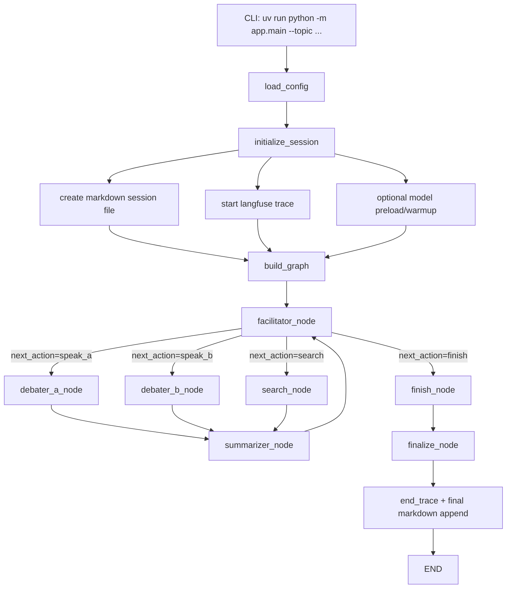

## リポジトリの処理フロー

このアプリは CLI 起動から終了まで、以下の順に処理されます。

1. `app.main` が引数（`--topic`, `--max-turns`, `--no-preload`）を受け取る
2. `initialize_session()` が設定・各サービス・初期 state を構築
3. `build_graph()` で LangGraph を構築して実行
4. `facilitator_node()` が次アクションを決定（structured output）
5. アクションに応じて `debater_a` / `debater_b` / `search` へ分岐
6. `summarizer_node()` が context を圧縮して facilitator に戻す
7. `finish` 判定後、`finalize_node()` で最終要約とトレース終了
8. Markdown ログと最終サマリーを出力して終了

## Mermaid フロー図

## 補足: 失敗時の扱い

- Facilitator / Debater は失敗種別ごとに retry 戦略を分離
- model not loaded は `ModelManager.ensure_loaded()` で回復を試行
- search CLI の timeout / 非0終了は分離して記録
- 回復不能時は `finish` 側に寄せる安全フォールバックを採用
